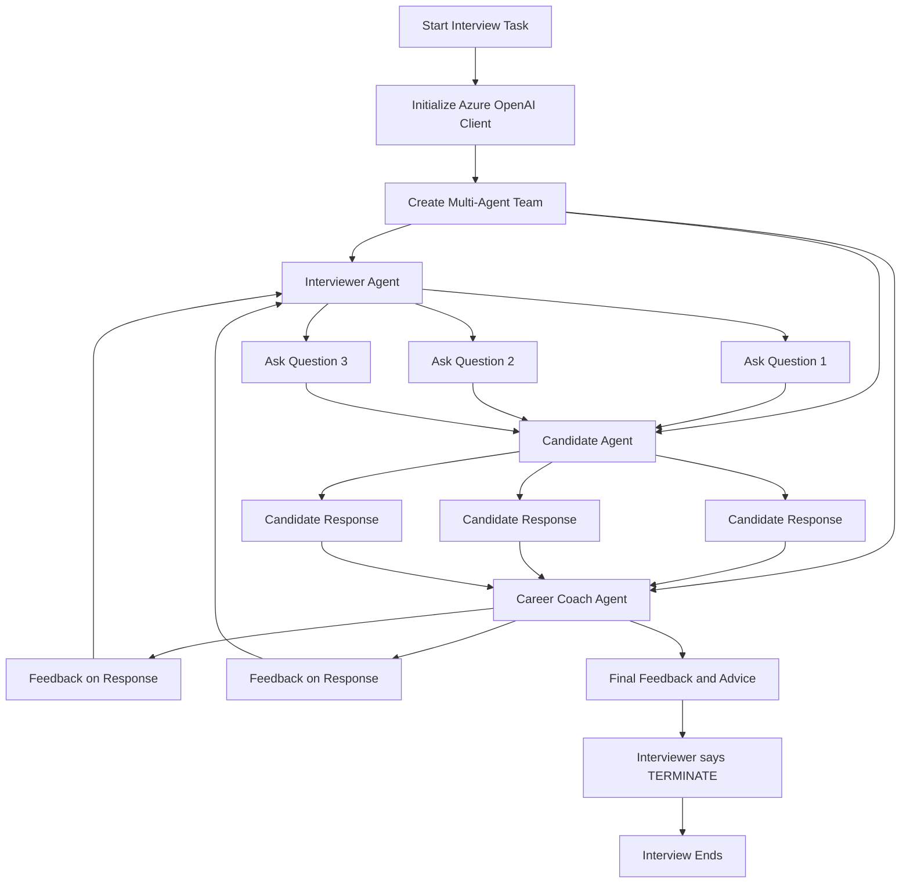

# AI-Interview

An **AI-powered mock interview system** built with a **multi-agent architecture** using AutoGen-style agents and **Azure OpenAI**.

This project simulates a real interview experience for a **Software Engineer** role by coordinating three specialized agents:

- **Interviewer** → asks structured interview questions
- **Candidate** → responds interactively during the session
- **Career Coach** → provides feedback after each response and summarizes overall performance

The repository includes **two implementations** of the same interview idea:
- `AI_interview_AG2.py`
- `AI_interview_autogen.py`

---

## Overview

This project demonstrates how **multi-agent conversational AI** can be used to simulate a structured technical interview.

The system is designed to:
- ask interview questions one at a time
- collect candidate responses interactively
- provide coaching feedback after each answer
- summarize candidate performance at the end

The interview is limited to **3 questions**, covering:
- technical skills and experience
- problem-solving ability
- cultural fit

---

## Workflow



---

## How It Works

### 1. Azure OpenAI Configuration
The project loads Azure OpenAI credentials from environment variables using `python-dotenv`.

The scripts use:
- `AZURE_OPENAI_API_KEY`
- `AZURE_OPENAI_ENDPOINT`
- `AZURE_OPENAI_API_VERSION`
- `AZURE_OPENAI_DEPLOYMENT`  
or a deployment mapping from:
- `AZURE_DEPLOYMENT_DEFAULTS`

This allows the interview agents to run on an Azure-hosted language model.

---

### 2. Multi-Agent Interview Design

The interview is handled by three agents:

#### Interviewer Agent
The interviewer acts like a professional interviewer for a **Software Engineer** role.

Its responsibilities:
- ask one question at a time
- wait for the candidate’s response
- ignore coach comments while continuing the interview
- ask exactly **3 questions**
- end the session with `TERMINATE`

#### Candidate Agent
The candidate is the interactive participant in the interview.

Depending on the implementation:
- one version uses a `UserProxyAgent`
- one version uses an interactive input-based candidate agent

This allows the user to answer each question in real time.

#### Career Coach Agent
The career coach reviews each candidate answer and provides:
- brief constructive feedback
- suggestions for improvement
- a final summary with actionable advice

---

## Core Interview Flow

The interview follows a repeated cycle:

1. The **Interviewer** asks a question  
2. The **Candidate** responds  
3. The **Career Coach** gives feedback  
4. The cycle continues until 3 questions are completed  
5. The interview ends when the interviewer says **`TERMINATE`**

This creates a realistic mock interview plus coaching loop.

---

## Repository Structure

```text
AI-Interview/
├── AI_interview_AG2.py
├── AI_interview_autogen.py
└── README.md
```

---

## Two Implementations in This Repo

### `AI_interview_AG2.py`
This version uses:
- `AssistantAgent`
- `UserProxyAgent`
- `GroupChat`
- `GroupChatManager`

It runs the interview using a **round-robin group chat** approach where each agent participates in order.

### `AI_interview_autogen.py`
This version uses:
- `autogen_agentchat`
- `AzureOpenAIChatCompletionClient`
- `RoundRobinGroupChat`
- `TextMentionTermination`

It follows a more updated team-based structure with an explicit termination condition based on the word **`TERMINATE`**.

---

## Architecture

This project follows a **multi-agent conversational architecture**:

- **Azure OpenAI**  
  Provides the LLM backend for reasoning and response generation

- **AutoGen / AgentChat-style agents**  
  Define the interviewer, candidate, and coach roles

- **Round-robin conversation flow**  
  Controls the speaking order between agents

- **Termination condition**  
  Stops the session after the third interview question

---

## Features

- AI-based mock interview simulation
- Multi-agent role separation
- Interactive candidate participation
- Real-time feedback after each answer
- Final performance summary
- Azure OpenAI integration
- Two different implementation styles in one repository

---

## Input and Output

### Input
The system starts with an interview task such as:

```text
Conduct an interview for a Software Engineer position
```

The user then responds interactively to each interview question.

### Output
The system produces:
- 3 interview questions
- candidate interaction
- coaching feedback after each response
- a final short performance summary and improvement advice

---

## Environment Variables

Create a `.env` file in the project root and add:

```env
AZURE_OPENAI_API_KEY=your_api_key
AZURE_OPENAI_ENDPOINT=your_endpoint
AZURE_OPENAI_API_VERSION=your_api_version
AZURE_OPENAI_DEPLOYMENT=your_deployment_name
```

Optional deployment mapping:

```env
AZURE_DEPLOYMENT_DEFAULTS={"deployment_names":{"gpt-4.1":"your_deployment_name"}}
```

---

## Installation

### 1. Clone the repository

```bash
git clone https://github.com/shivanimadhavan/AI-Interview.git
cd AI-Interview
```

### 2. Install dependencies

For a basic setup, install:

```bash
pip install python-dotenv pyautogen autogen-agentchat autogen-ext
```

> Install only the packages needed for the version you want to run.

---

## Run the Project

### Run the AG2 / group chat version

```bash
python AI_interview_AG2.py
```

### Run the AgentChat version

```bash
python AI_interview_autogen.py
```

---

## Example Execution Flow

```text
Interviewer: Tell me about your technical experience as a Software Engineer.
Candidate: [User enters response]
Career Coach: Good structure, but include more measurable impact.

Interviewer: Describe a challenging problem you solved.
Candidate: [User enters response]
Career Coach: Strong example. Try to explain your reasoning more clearly.

Interviewer: How do you collaborate in a team environment?
Candidate: [User enters response]
Career Coach: Good answer. Add a concrete example for stronger impact.

Interviewer: TERMINATE
```

---

## Use Cases

This project can be extended for:
- interview preparation
- AI-based coaching systems
- communication practice
- technical role simulation
- HR and training prototypes
- candidate self-assessment tools

---

## Future Improvements

- support multiple job roles dynamically
- add resume-based personalized questions
- score candidate answers numerically
- save interview history to file
- add a web UI using Streamlit or FastAPI
- support role-specific interview tracks such as frontend, backend, AI, or DevOps

---

## Author

**Shivani Madhavan**
